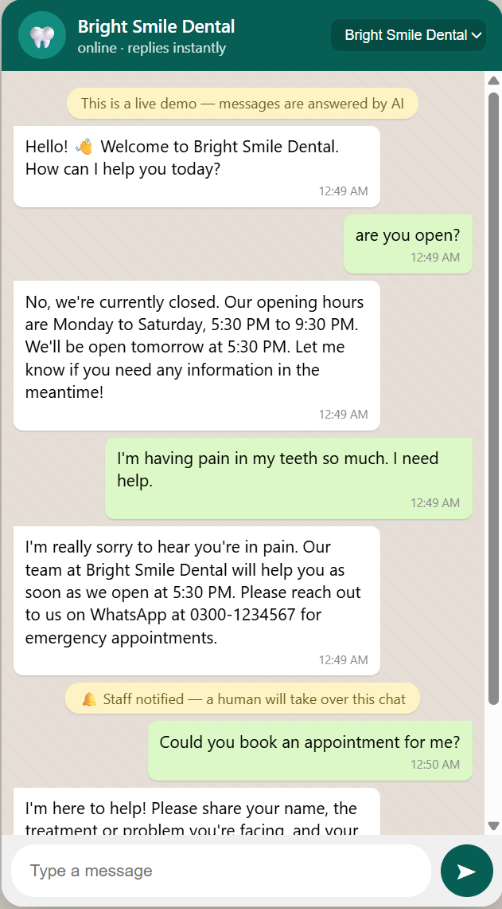

# WhatsApp AI Assistant

A small AI reply bot for local businesses. It answers customer questions on WhatsApp using that
business's own info (prices, hours, policies) and hands off to a human when it can't help. I built
it to actually sell as a subscription, not as a portfolio toy, so a lot of the decisions below are
about what breaks a small business's trust in it, not what's technically interesting.

## Why I built it

I messaged a hotel on WhatsApp to ask about a room. I got one auto-reply and then nothing for
hours. That's normal for small, owner-run places: clinics, salons, hotels, restaurants. They put
WhatsApp on their signboard because customers expect it, but nobody's actually free to answer it
all day.

## How it works

One Node/Express server runs the assistant for every client at once. Each business is just a JSON
file with its info in it (rooms and prices, opening hours, what it doesn't offer, any special
rules). Onboarding a new client means writing that file, not touching the code.

A few decisions along the way mattered more than I expected:

I picked the official Meta WhatsApp Cloud API instead of one of the unofficial gateways people use
for bots like this. Unofficial numbers get banned once the message pattern looks automated, and if
a client's number gets banned that's the whole relationship gone, not just a bug.

For the model, I tested gpt-4o-mini against gpt-4o on a set of about a dozen questions I wrote to
cover pricing, edge cases, and things the business doesn't offer. Mini kept telling customers "no"
to services that were never mentioned in the business info at all, it was just guessing. That's the
one mistake that actually costs a client money (a real customer gets turned away over nothing), so
I went with gpt-4o even though it costs more per reply. Still comes out to roughly a quarter of a
cent per message, which leaves plenty of room under a $20-25/month subscription.

The switch between OpenAI and Anthropic is one line in the .env file. I didn't want the whole
product tied to one company's pricing or uptime.

The thing that made the biggest difference in testing wasn't a prompt trick, it was asking every
client one specific question during onboarding: "what do people ask for that you don't offer?"
Without that list, the bot hands off almost everything it isn't sure about, which is safe but
useless. With the list, it can say "no" confidently and correctly instead of punting to a human.

Different businesses need different guardrails. The dental clinic profile flatly bans the model
from giving any medical opinion, suggesting medicine, or guessing how serious something sounds.
Anything like that goes straight to staff.

## What it actually does, from the demo

The dental clinic profile below (Bright Smile Dental, name and details changed to keep the real
business private) is modeled on an actual prospect I'm talking to in Lahore: open 5:30-9:30 PM, but
their own website tells patients to WhatsApp them for emergencies. So in practice they're
unreachable close to 20 hours a day. A patient messaged the demo at night:

> Assalam o alaikum, I need an urgent dental appointment tonight, is that possible?

and got:

> Wa alaikum assalam! Our clinic is currently closed as our opening hours are Monday to Saturday
> from 5:30 PM to 9:30 PM. Please share your name, the treatment or problem, and your preferred day
> and time, and our team will get back to you when we open tomorrow. Stay comfortable, and we'll be
> in touch soon!

and the chat got flagged for staff to pick up in the morning. That reply, at midnight, is the whole
pitch to a business owner.

Here's the "don't offer" list working as intended, this time from the hotel profile:

> Hi, does the hotel have a swimming pool and gym?
>
> No, we don't have a swimming pool or gym at Sunrise Hotel. If you have any other questions or
> need assistance, feel free to ask!

No hedging, no handoff, just a correct answer because the profile told it not to guess.

And the medical guardrail, screenshotted straight from the demo:



A patient asked if the clinic was open, got the hours, then said their teeth were hurting badly and
they needed help. The bot didn't touch the medical question at all, it just expressed sympathy,
told them staff would help as soon as they opened, and pointed them to WhatsApp for emergencies,
then flagged the chat for a human. When the patient asked to book an appointment right after, it
asked for name, problem, and preferred time and handed that off too. No diagnosis, no "try
ibuprofen," nothing it isn't qualified to say.

It also just handles Urdu, English, and Roman Urdu in the same conversation without any language
detection code. That's one line in the system prompt, not a feature I built.

## Architecture

```
customer WhatsApp message
        |
        v
  Meta Cloud API webhook  --------------->  Express server (server.js)
        |                                        |
        |                                  loads business profile
        |                                  (businesses/<id>.json)
        |                                        |
        |                                  builds system prompt
        |                                  (info + safety rules)
        |                                        |
        |                                  ai.js -> OpenAI or Anthropic
        |                                  (provider chosen via .env)
        |                                        |
        |                                  reply text (+ hidden
        |                                  [HANDOFF] token if needed)
        |                                        |
        <---------------  whatsapp.js sends reply back via Cloud API
```

Adding a client is dropping a new file into `businesses/`, nothing in the code changes.
`demo-guard.js` rate-limits the public demo link so a stranger who finds the URL can't run up my
OpenAI bill. And whenever the model decides a message needs a person (a real booking, something
outside the business info, someone asking for a human or complaining), it appends a hidden
`[HANDOFF]` token that the server logs. In production that would trigger a staff notification and
pause the bot on that conversation.

## Stack

Node.js, Express, OpenAI (gpt-4o) with Anthropic as a drop-in alternative, Meta WhatsApp Cloud API,
and a plain HTML/CSS/JS page for the demo chat window.

## Where it's at

I built a test set of pricing questions, out-of-scope questions, booking requests, a few "try to
trick it into giving medical advice" traps, and some Roman Urdu input. It's passing all of them
now. I've also built a demo profile for an actual prospect (the dental clinic above, anonymized
here), found by looking for businesses that advertise WhatsApp booking but only staff it a few
hours a day, since they've already committed to the channel and clearly can't keep up with it.

The plan is $15-80/month depending on the business, plus a small one-time setup fee, and the sales
pitch is just handing the owner a phone with their own business info already loaded in, rather than
a slide deck.

## Still to do

Wire up a real number through the Cloud API for a paying client (right now it's a local server
behind a temporary cloudflared tunnel), build somewhere for staff to see the handoff queue instead
of a server log, and move it off my laptop onto an actual host.
